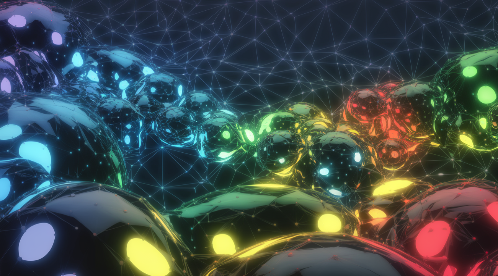

# Living AI Agent System



A browser-based visualization of AI agents moving in a dynamic ecosystem, creating flowing patterns and trails. Built with **Three.js** and **TypeScript**, this project brings AI agents to life in a mesmerizing 3D environment, where they interact and evolve in real-time. Each agent follows a leader, forming a chain of movement with oscillating trails, all rendered directly in your browser using WebGL.

---

## Features

- **Real-time 3D Visualization**: Watch AI agents move and interact in a flowing, dynamic pattern.
- **Agent Behavior**: Agents follow a leader in a chain, creating a snake-like movement with oscillating trails.
- **Unique Visuals**: Each agent has a distinct color and leaves a fading trail, adding depth and beauty to the scene.
- **Screen Wrapping**: Agents seamlessly reappear on the opposite side when they move off-screen, creating a continuous environment.
- **Tech Stack**:
  - **Three.js**: For WebGL rendering, enabling smooth and performant 3D graphics in the browser.
  - **TypeScript**: For type safety and better development experience.
  - **Vite**: For fast development and building, providing instant feedback during development.

---

## Installation

To get started with the Living AI Agent System, follow these steps:

### Prerequisites

Ensure you have the following installed:
- [Node.js](https://nodejs.org/) (version 14 or higher recommended)
- [npm](https://www.npmjs.com/) (comes with Node.js)

### Steps

1. **Clone the Repository**:
   ```bash
   git clone https://github.com/yourusername/livingai.git
   ```
   *Replace `yourusername` with your actual GitHub username.*

2. **Navigate to the Project Directory**:
   ```bash
   cd livingai
   ```

3. **Install Dependencies**:
   ```bash
   npm install
   ```
   This will install all required packages, including Three.js, TypeScript, and Vite, as specified in `package.json`.

---

## Usage

Once installed, you can run the project in various modes:

### Development Mode

Start the development server to view the visualization in real-time:
```bash
npm run dev
```
- This launches a server at `http://localhost:6873`.
- The page updates automatically as you make changes to the code, thanks to Vite's hot module replacement.

### Build for Production

Create an optimized production build:
```bash
npm run build
```
- This compiles the TypeScript code and bundles the assets into the `dist` folder.
- The build is optimized for performance and ready for deployment.

### Preview the Build

Serve the production build locally to test it:
```bash
npm run preview
```
- This starts a local server to preview the contents of the `dist` folder.

---

## How It Works

The Living AI Agent System simulates a chain of AI agents, each following the one before it, creating a flowing, organic movement. The agents are rendered as colored spheres with trails that fade over time, adding a sense of motion and depth to the visualization.

### Scene Setup

- The scene is initialized using Three.js, with a black background (`0x000000`) for contrast.
- A perspective camera is used, positioned at `z = 30` to provide a clear view of the agents.
- The WebGL renderer is set up with antialiasing for smooth edges and full-screen rendering.

### EcoAgent Class

Each agent is an instance of the `EcoAgent` class, defined in `main.ts`. The class manages the following properties and behaviors:

#### Properties

- **Position** (`THREE.Vector3`): The current location of the agent in 3D space.
- **Velocity** (`THREE.Vector3`): The direction and speed of movement.
- **Trail** (`THREE.Vector3[]`): An array of past positions, used to render the agent's trail.
- **Color** (`THREE.Color`): A unique color for the agent and its trail.
- **Leader** (`EcoAgent | null`): The agent this instance follows, if any.
- **Followers** (`EcoAgent[]`): List of agents following this instance.
- **Phase** (`number`): Used for oscillation in movement, adding natural variation.

#### Constructor

- Initializes the agent with a random starting position and velocity.
- Assigns a unique color and sets up the trail with the starting position.
- Randomizes the phase for oscillation effects.

#### Update Method

The `update` method is called each frame to update the agent's position and behavior:

- **If the Agent Has a Leader (Follower Behavior)**:
  - Targets a point in the leader's trail (10 steps behind, or the leader's current position if the trail is shorter).
  - Calculates the direction to the target and normalizes it.
  - Adds oscillation by computing a perpendicular vector and scaling it with a sine function, creating a wavy, natural motion.
  - Adjusts speed based on distance to the leader, ensuring smooth following behavior.
  - Updates velocity using linear interpolation (`lerp`) for gradual changes.

- **If the Agent Is a Leader (No Leader)**:
  - Moves in a flowing pattern using sine and cosine functions for the x and y directions.
  - Updates velocity using `lerp` for smooth transitions.

- **Position Update**:
  - Adds the velocity to the position to move the agent.
  - Implements screen wrapping:
    - If the agent moves beyond ±30 units in x or y, it reappears on the opposite side.
    - This creates a continuous, boundary-less environment.

- **Trail Update**:
  - Adds the current position to the trail.
  - Limits the trail to 50 points, removing the oldest point if necessary.

### Agent Chain Setup

- 25 agents are created with random starting positions and colors.
- The agents are connected in a chain:
  - The first agent (index 0) is the leader and has no leader.
  - Each subsequent agent follows the previous one (e.g., agent 1 follows agent 0, agent 2 follows agent 1, etc.).
  - Leaders store references to their followers, forming a bidirectional chain.

### Rendering

- **Agent Meshes**:
  - Each agent is represented as a sphere (`THREE.SphereGeometry`, radius 0.2, 16 segments).
  - Uses `THREE.MeshBasicMaterial` with the agent's unique color.
  - Added to the scene and updated each frame with the agent's position.

- **Trail Lines**:
  - Each trail is rendered as a line (`THREE.Line`) using `THREE.BufferGeometry`.
  - The trail geometry is updated each frame with the agent's trail positions.
  - Uses `THREE.LineBasicMaterial` with:
    - The agent's color.
    - Transparency (`opacity: 0.5`) and additive blending for a glowing, fading effect.

- **Animation Loop**:
  - Runs continuously using `requestAnimationFrame`.
  - Updates each agent's position and trail using the `EcoAgent` class.
  - Updates the corresponding mesh and trail line in the scene.
  - Renders the scene with the camera using the WebGL renderer.

---

## Configuration

You can customize the simulation by modifying the following in `main.ts`:

### Number of Agents

- Adjust the loop that creates the agents:
  ```typescript
  for (let i = 0; i < 25; i++) {
  ```
  - Change `25` to the desired number of agents.
  - Note: Each agent after the first will follow the previous one, forming a longer or shorter chain.

### Screen Bounds

- Modify the `bounds` variable:
  ```typescript
  const bounds = 30;
  ```
  - This sets the wrapping area to ±30 units in x and y.
  - Increase or decrease this value to change the size of the visible area.

### Other Potential Adjustments

- **Agent Size**: Modify the sphere geometry in the rendering section (e.g., change the radius from 0.2).
- **Trail Length**: Adjust the trail limit in the `update` method (e.g., change `50` to a different number).
- **Movement Speed**: Adjust the speed factors in the `update` method (e.g., `speed = THREE.MathUtils.clamp(distance * 0.1, 0.05, 0.2)`).
- **Oscillation Amplitude/Frequency**: Modify the oscillation parameters in the follower behavior (e.g., change `Math.sin(time * 0.002 + this.phase) * 0.5`).

---

## Project Structure

The project is organized as follows:

- **`src/main.ts`**: Core logic, including the `EcoAgent` class, scene setup, and animation loop.
- **`src/style.css`**: Minimal CSS for full-screen rendering:
  - Resets margins and padding.
  - Hides overflow to ensure the visualization fills the screen.
- **`index.html`**: Basic HTML structure linking the CSS and TypeScript files.
- **`vite-env.d.ts`**: Type definitions for Vite environment variables (currently unused).
- **`vite.config.ts`**: Vite configuration, specifying the development server port (6873) and build target (`esnext`).
- **`tsconfig.json`**: TypeScript configuration, enabling strict type checking and ESNext modules.
- **`package.json`**: Project metadata, scripts, and dependencies.

---

## Dependencies

The project uses the following dependencies (listed in `package.json`):

### Runtime Dependencies

- **`three`**: For 3D rendering with WebGL.
- **`typescript`**: For type-safe development.
- **`@types/node`**: Type definitions for Node.js (used by TypeScript).
- **`dspy.ts`**: Not currently used in the provided code; possibly for future AI integration.
- **`onnxruntime-web`**: Not currently used; possibly for future machine learning model execution.

### Development Dependencies

- **`@types/three`**: Type definitions for Three.js.
- **`vite`**: Fast build tool and development server.

Note: Dependencies like `dspy.ts` and `onnxruntime-web` are not used in the current implementation. If they are intended for future features, consider documenting them in a "Future Work" section.

---

## Browser Compatibility

- The project uses WebGL (via Three.js) for rendering.
- It should work in modern browsers that support WebGL, including:
  - Google Chrome
  - Mozilla Firefox
  - Safari
  - Microsoft Edge
- Ensure WebGL is enabled in your browser for the visualization to work.

---

## Contributing

Contributions are welcome! If you'd like to improve the project or add new features, please follow these steps:

1. Fork the repository.
2. Create a new branch for your changes.
3. Make your changes and test them thoroughly.
4. Submit a pull request with a clear description of your changes.
5. Report any issues or bugs using the GitHub Issues tab.

---

## License

This project is licensed under the [ISC License](https://opensource.org/licenses/ISC).

---

## Acknowledgments

- **[Three.js](https://threejs.org/)**: For providing the powerful WebGL library that makes this visualization possible.
- **[Vite](https://vitejs.dev/)**: For enabling fast and efficient development and building.
- **[TypeScript](https://www.typescriptlang.org/)**: For improving code quality and maintainability.

---

## Notes for Customization

- **Repository URL**: Replace `yourusername` in the clone URL with your actual GitHub username.
- **Screenshots/GIFs**: Add a screenshot or GIF to the README by updating the image path (`path/to/screenshot.png`) to showcase the visualization. Take a screenshot of the running application and place it in the repository.
- **Deployment**: The project can be easily deployed to platforms like Netlify, Vercel, or GitHub Pages using the `dist` folder after building. Consider adding deployment instructions if desired.
- **Future Work**: If you plan to integrate AI models (e.g., using `dspy.ts` or `onnxruntime-web`), consider adding a section to outline upcoming features, such as:
  - Machine learning models controlling agent behavior.
  - Dynamic agent interactions based on environmental factors.
  - Enhanced visualization effects.

I am an AI Business Consultant.  If you want to know how AI can best assist your company then reach out to Frontier Tech Strategies. frontiertechstrategies.com
